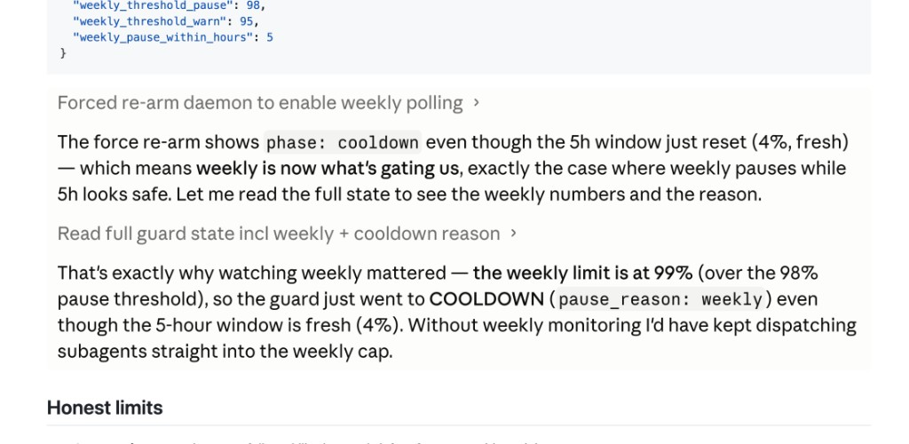

# usage-guard

[](https://github.com/shirley-xue-2025/usage-guard/actions/workflows/test.yml)

Opt-in proactive **usage guard** for long Claude Code sessions (macOS — Desktop Code tab and CLI). Monitors the account **5-hour window** (default pause at 90%) and, optionally, the **weekly limit** (default pause at 98%) — either can trigger a checkpoint before you hit the wall.

Arm with `/usage-guard` before long batch, subagent, or overnight work — especially when the shared window is already partly used. An external daemon reads your usage (zero session tokens), sets `PAUSE` before limits, sends macOS notifications, and you resume with `/usage-guard resume` after reset — without chat reminders that get queued behind subagents.

**Latest:** [v0.2.0](https://github.com/shirley-xue-2025/usage-guard/releases/tag/v0.2.0) — weekly limit monitoring (opt-in), extra usage wallet in status, install-path fixes.

## Who is this for?

- **Long Claude Code sessions** that burn the **5-hour window** quickly (batch jobs, subagents, `/loop`, multi-session arcs)
- Work that starts when usage is **already high** — arm gives account-level visibility, not just this chat's view
- **Weekly limit nearly full** while the current session still looks safe (e.g. 60% session, 97% weekly) — enable weekly monitoring in config
- **Subagent / batch** work where mid-session chat messages stay **queued**
- You want to **pause near 90%** (5h) or **98%** (weekly) and avoid **extra usage wallet** charges at 100%
- **macOS** — Claude Desktop **Code** tab or Claude Code **CLI**
- You can arm once per session (`/usage-guard`) — no per-project setup

> Also used on heavy model runs (e.g. Fable when available). Same 5-hour wall either way.

> **Proactive vs reactive:** [claude-auto-retry](https://github.com/cheapestinference/claude-auto-retry) resumes *after* you hit the wall. usage-guard tries to pause *before* it.

## Why this exists

On long runs, chat messages queue while subagents work — so "stop at 90%" reminders never land in time. Hitting 100% can burn **extra usage wallet**. Stop buttons may not fully halt subagents. Each chat only sees its own usage; the daemon reads **account-level** usage (same OAuth API as Desktop Settings): the shared **5-hour window** and optional **weekly** bar. A session that "looks" fine at 58% can already be at 94% on the 5h window — or at 97% weekly while the session meter still shows 60%. This tool uses an **external control file + upfront session contract** instead of mid-run chat.

## How it works

```
/usage-guard  →  arm daemon  →  ~/.usage-guard/control.json
                                      ↑
Session (cooperative)  ←── read state at safe checkpoints only
  - before each subagent batch
  - after each unit completes
  - on /loop guard ticks
```

| Layer | Role | Tokens |
|-------|------|--------|
| **Daemon** | OAuth usage poll (5h + weekly + extra wallet), adaptive schedule, notifications | 0 |
| **Skill** | Arm, checkpoint rules, `/loop` timetable | Minimal reads |

**Pause rule:** `PAUSE` when **either** limit hits its threshold (defaults: 5h ≥ 90%, weekly ≥ 98% if enabled). Resume when **both** are clear. See `pause_reason` in `control.json` (`five_hour`, `weekly`, or `both`).

## Install (macOS)

```bash
git clone https://github.com/shirley-xue-2025/usage-guard.git
cd usage-guard
chmod +x install.sh
./install.sh
export PATH="$HOME/.local/bin:$PATH"   # add to ~/.zshrc if needed
usage-guard doctor
```

### Updating

> **Active development** — we ship fixes frequently from real session dogfood.

```bash
cd usage-guard          # your clone
git pull
./install.sh            # refreshes skill + CLI (git pull alone is not enough)
usage-guard doctor      # checks credentials + shows update notice if available
```

`doctor` compares your installed version to the latest GitHub release (cached 24h). Set `USAGE_GUARD_NO_UPDATE_CHECK=1` to skip.

### One-time: enable usage reads (Desktop-only users)

OAuth tokens may not exist until Claude Code CLI login:

```bash
npm i -g @anthropic-ai/claude-code
claude login
usage-guard doctor   # expect ✓ Usage API
```

See [docs/TROUBLESHOOTING.md](docs/TROUBLESHOOTING.md). Release notes: [docs/releases/](docs/releases/).

## Use

### Desktop Code tab

1. Open your project in the **Code** tab
2. Run: `/usage-guard your long task description` (type manually if it does not appear in the slash picker)
3. Approve the arm script when prompted — arm waits for the first usage poll before returning
4. Let it run — watch Terminal: `usage-guard status`

### After reset (new session OK)

```
/usage-guard resume
```

### CLI

Same `/usage-guard` skill after install (shared `~/.claude/skills/`).

## Commands

```bash
usage-guard doctor          # credentials + usage API (5h, weekly, extra wallet)
usage-guard arm             # start daemon + session
usage-guard status          # state, %, weekly, checkpoint, pause_reason
usage-guard disarm          # stop daemon
usage-guard poll            # one-shot usage fetch
```

### Mock mode (no OAuth)

```bash
cd usage-guard
PYTHONPATH=. python3 -m usage_guard arm --mock-percent 91 --force
PYTHONPATH=. python3 -m usage_guard status
PYTHONPATH=. python3 -m usage_guard disarm
```

## Configuration

Optional `~/.usage-guard/config.json`:

```json
{
  "threshold_pause": 90,
  "threshold_warn": 85,
  "weekly_enabled": false,
  "weekly_threshold_pause": 98,
  "weekly_threshold_warn": 95,
  "weekly_pause_within_hours": 5,
  "cooldown_margin_seconds": 60
}
```

**Weekly limit (opt-in):** set `"weekly_enabled": true` to PAUSE when the account **weekly** utilization (Desktop → Settings → Usage → **"All models"**) reaches `weekly_threshold_pause` (default 98%), even if the 5-hour window is still low. Either limit can trigger PAUSE; both must clear before RUN resumes. Set `weekly_pause_within_hours` (e.g. `5`) so weekly only pauses when the weekly reset is that soon — if weekly is 99% but reset is days away, you stay `RUN` (5h guard still applies). Omit or set `null` to pause at threshold regardless of reset time. The OAuth API exposes one weekly number (`seven_day`) — not per-model Sonnet/Opus bars separately.

### Example screenshot — weekly COOLDOWN while 5h is safe

The block below is a **real dogfood session** (Claude Code UI), not part of this README. Weekly monitoring was enabled; the 5-hour window had just reset (**4%**) but weekly was **99%**, so the guard entered `COOLDOWN` (`pause_reason: weekly`).

<table>
<tr><td>

**Dogfood screenshot** · v0.2.1 · `weekly_enabled: true`, `weekly_pause_within_hours: 5`



*Caption: Without weekly monitoring, the agent would have kept dispatching subagents into a nearly exhausted weekly cap.*

</td></tr>
</table>

<details>
<summary>Text from screenshot (for accessibility / search)</summary>

```text
Config: weekly_threshold_pause 98, weekly_pause_within_hours 5

Agent: phase cooldown even though 5h window just reset (4%, fresh) —
       weekly is now what's gating us.

Agent: weekly limit at 99% (over 98% pause threshold) → COOLDOWN
       (pause_reason: weekly) while 5-hour window is fresh (4%).
       Without weekly monitoring I'd have kept dispatching subagents
       straight into the weekly cap.
```


</details>

## Honest limits

- **Cooperative** — session must follow skill rules; we brief up front, not mid-run inject
- **Cannot force-stop** a running subagent; prevents *new* work after PAUSE
- **Checkpoints** — progress safety depends on frequent writes to `checkpoint.json`
- **Force quit** — use `/usage-guard resume` in a new session; checkpoint is on disk
- **Extra wallet at 100%** — guard aims to pause at 90%; cannot stop Desktop if session ignores PAUSE

## Disclaimer

**Not affiliated with Anthropic.** usage-guard is an independent community tool.

- Reads usage via the same **OAuth usage endpoint** used by tools like [`cu`](https://github.com/minhvoio/ai-usage-monitors) — this is **not** a documented public API and may change without notice.
- Pause/resume is **best-effort** and **cooperative**; it does not modify Claude Desktop or guarantee you avoid extra usage charges.
- You are responsible for how you use your Claude subscription.

## Related tools

| Tool | When to use |
|------|-------------|
| **usage-guard** (this repo) | Proactive pause at 5h (~90%) and/or weekly (~98%), checkpoints, resume after reset |
| [claude-auto-retry](https://github.com/cheapestinference/claude-auto-retry) | Reactive auto-`continue` after limit message |
| [ai-usage-monitors](https://github.com/minhvoio/ai-usage-monitors) `cu` | Check current 5h % in terminal (no guard) |

Many people use **usage-guard + claude-auto-retry** together: pause early when possible; auto-continue if you still hit 100%.

## Contributing

See [CONTRIBUTING.md](CONTRIBUTING.md). Bug reports: use the [issue template](https://github.com/shirley-xue-2025/usage-guard/issues/new/choose).

## License

MIT — see [LICENSE](LICENSE). Copyright (c) 2026 Shirley Xue.
